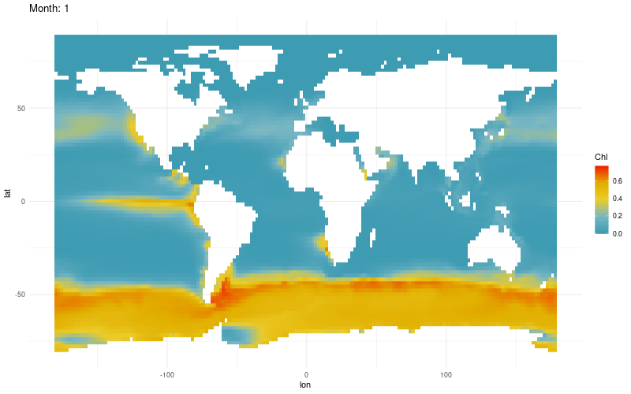

```{r setup, include=FALSE}
## Knitr setup
knitr::opts_chunk$set(fig.width = 7, fig.height=7, echo=TRUE, warning=FALSE,
                      message=FALSE, eval=TRUE, cache=TRUE,
                      dev=c('png', 'pdf', 'svg'))

## Cache setup
origCache <- knitr::opts_chunk$get("cache.path")
base <- sub("_cache/.*$", "", origCache)
knitr::opts_chunk$set(cache.path = file.path(getwd(), 'cache', paste0(base, "/")),
                      fig.path = file.path(getwd(), 'figures', paste0(base, "/")))

## Load packages
library(dplyr)
library(omd)
library(rworldmap)
library(maps)
library(data.table)
library(grid)
library(gridExtra)
library(wesanderson) ##names(wes_palettes)
library(ggplot2)
library(gganimate)
library(gifski)

## List the climatology data files 
datadir = "~/Dropbox/research/usc/ocean-provinces/omd/data"
filenames = c("tabulated_darwin_montly_clim_045_090_ver_0_2.csv",
              "tabulated_darwin_montly_clim_090_180_ver_0_2.csv",
              "tabulated_darwin_montly_clim_180_360_ver_0_2.csv",
              "tabulated_darwin_montly_clim_360_72  0_ver_0_2.csv",
              "tabulated_geospatial_montly_clim_045_090_ver_0_2.csv",
              "tabulated_geospatial_montly_clim_090_180_ver_0_2.csv",
              "tabulated_geospatial_montly_clim_180_360_ver_0_2.csv",
              "tabulated_geospatial_montly_clim_360_720_ver_0_2.csv")

## Yellow box
lat = 19.8968
lon = -155.5828
boxsize = 30 ## 30
lonrange = lon + c(-1,1) * boxsize
latrange = lat + c(-1,1) * boxsize

## Gather data
darwin_dat = fread(file.path(datadir, filenames[2]), select=c("lat", "lon", "month", "Chl"))
real_dat = fread(file.path(datadir, filenames[2+4]), select=c("lat", "lon", "month", "Chl"))
```


```{r}
restrictbox <- . %>% filter(lat > latrange[1],
                      lat < latrange[2],
                      lon > lonrange[1],
                      lon < lonrange[2],
                      month == 10)
dlong = darwin_dat%>% restrictbox() %>% select(lat=lat, lon=lon, val=Chl)
rlong = real_dat%>% restrictbox() %>% select(lat=lat, lon=lon, val=Chl)
dlong %>% pull(val) %>% summary()
rlong %>% pull(val) %>% summary()
## omd(M1_long = ,
##     M2_long = real_dat%>% restrictbox() %>%  select(lat=lat, lon=lon, val=Chl))
## Continue here.
```


Trying a pseudo-real example:

```{r message = FALSE, warning = FALSE, results = FALSE, fig.show='animate'}
min_chl = darwin_dat %>% group_by(month) %>% summarize(mins = min(Chl)) %>% select(mins) %>% min()
max_chl = darwin_dat %>% group_by(month) %>% summarize(maxs = max(Chl)) %>% select(maxs) %>% max()

pal <- wes_palette("Zissou1", 100, type = "continuous")

darwin_dat %>% 
  group_by(month) %>%
  ## mutate(cols = Chl %>% range_custom(min = min_chl, max = max_chl) %>% colfun() %>% adjustcolor(alpha=1)) %>% 
  ggplot() +
  ## facet_wrap(~ month, ncol = 4) +
  transition_time(month) +
  geom_raster(aes(y = lat, x = lon, fill = Chl)) +
  ## scale_fill_gradientn(c("yellow", "green", "blue"), guide="colorbar")
  scale_fill_gradientn(colours = pal) + 
  labs(title = 'Month: {frame_time}') +##, x = 'GDP per capita', y = 'life expectancy') +
  theme_minimal()  -> p

animate(p, duration = 5, fps = 5, width = 800, height = 500, renderer = gifski_renderer())
anim_save("combined.gif")
```



Okay this is cool. I still don't see a good example for the intro in the
climatology dataset. I'll have to download Chris's dataset to make this


The next steps:

* Chris's dataset + intro example.
* Make a concurrent OMD + .
* Land crossing.


# Non-climatology Intro example

```{r}
library('cmap4r')
set_authorization(cmap_key = "5e05c500-d68d-11e9-9d3b-4f83fcec4710")
dat = get_spacetime(tableName = "tblCHL_REP",
                    varName = 'chl',
                    dt1='2017-03-01',
                    dt2='2017-05-2',
                    lat1=20,
                    lat2=50,
                    lon1=-170,
                    lon2=-150,
                    depth1=0,
                    depth2=100) ##%>% head(10) %>% kable()
cut = 0.3##0.8130424448
dat = dat %>% mutate(chl = pmin(chl, cut))

## Remove the outliers
dat %>% select(chl) %>% ggplot() +
  geom_histogram(aes(x=chl), bins=200) +
  geom_vline(xintercept = dat %>% pull(chl) %>% quantile(.999, na.rm = TRUE)) +
  xlab("Chlorophyll")

## Show the data
dat %>% group_by(time) %>% 
  ggplot() +
  facet_wrap(~ as.Date(time), ncol = 4) +
  geom_raster(aes(y = lat, x = lon, fill = chl)) +
  scale_fill_gradientn(colors=c("blue", "white", "red"), guide="colorbar", na.value = "grey50") +
  ggsave("~/intro-data.pdf", width = 20, height=10)

  ## scale_fill_gradientn(colours = pal,  na.value = "white")  
  ## labs(title = 'Month: {frame_time}') +##, x = 'GDP per capita', y = 'life expectancy') +

## 80 x 120 dataset
nlat = dat %>% group_by(time) %>% group_split() %>% .[[1]] %>% pull(lat) %>% unique() %>% length()
nlon = dat %>% group_by(time) %>% group_split() %>% .[[1]] %>% pull(lon) %>% unique() %>% length()
```

Can we calculate OMD between an 120 x 80 dataset (on my computer)? Nope.

```{r}
## Subset data from two dates 3/22 and 4/7
dates = dat %>% pull(time) %>% unique() 
time1 = dates[3]
time2 = dates[5]
M1_long = dat %>% subset(time == time1) %>%  select(-time) %>% rename(val = chl)
M2_long = dat %>% subset(time == time2) %>%  select(-time) %>% rename(val = chl)

## Subset an even smaller region
mysubset <- . %>% filter(lat > 30 & lat < 40)
M1_long = M1_long %>% mysubset()
M2_long = M2_long %>% mysubset()

## Impute NA's
impute <- function(dat){
  missing_rows = is.na(dat$val)
  if(any(missing_rows)){
    for(rownum in which(missing_rows)){
      onerow = dat[rownum,,drop=FALSE]
      find_neighbors = . %>% subset(abs(lat- onerow$lat) < sz & abs(lon- onerow$lon) < sz)
      imputed_value = dat %>%
        find_neighbors() %>%
        summarize(mean(val, na.rm=TRUE)) %>%
        unlist()
      assertthat::assert_that(!is.na(imputed_value))
      dat[rownum, "val"] = imputed_value
    }
  } 
  return(dat)
}

M1_long = impute(M1_long)
M2_long = impute(M2_long)
```

Make the plot:

```{r fig.width = 20, fig.height=7}
res = omd(M1_long = M1_long, M2_long = M2_long, p = 2)
fac = 7
pdf("~/omd-intro.pdf", width=3*fac, height=fac)
pdf("~/omd-intro-p-2.pdf", width=3*fac, height=fac)
plot_omd(res)
graphics.off()
```

This is too computationally expensive for my computer.

Can we get it done on a server? Let's see.

# How to handle NAs?

I can replace them with a window average. 


Some questions

* Can I calculate OMD on an 80 x 120 image? Nope
  + We could choose to coarsen the image.
  + We can also revisit approximations or Sinkhorn.
* How to handle NA values?
* How to handle crossing of land mass?
* How long does it take to run code for Aditya?
* Can sinkhorn save transports? I should make it so it can!


# What information is lost when averaging? 

Here's another idea for OMD:

When "averaging" across different images for a climatology dataset (let's say,
maps of Chlorophyll of over snapshots over

<!-- https://timogrossenbacher.ch/2016/12/beautiful-thematic-maps-with-ggplot2-only/ -->

<div class="tocify-extend-page" data-unique="tocify-extend-page" style="height: 0;"></div>
